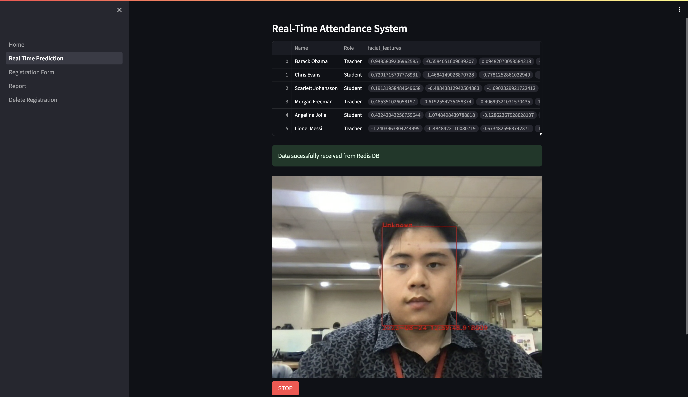
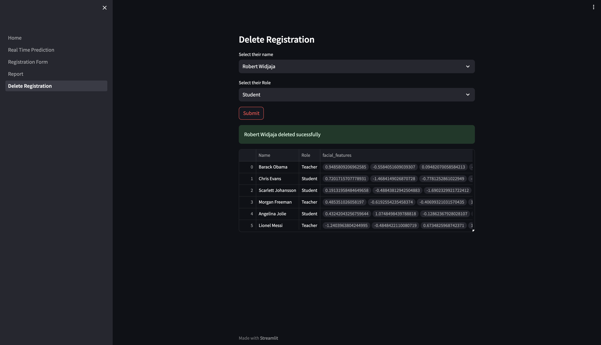

# Facial Attendance Platform

Facial Attendance Platform is a Python-based web application that uses OpenCV, Redis, and Streamlit to streamline the process of tracking attendance using facial recognition.

This Facial Attendance Platform uses InsightFace API and Maching learning searching algorithms to accruately detect facial features that uniquely identifies a person.

## Features

- [x] Real-time facial recognition for attendance tracking.
- [x] User-friendly web interface built with Streamlit.
- [x] Store attendance records in Redis for quick retrieval and analysis.
- [x] Easily configurable and customizable.
- [x] Registration form using webcam to collect samples
- [x] Reporting modules that has real-time updates when a person is marked for attendance  

## Screenshots

