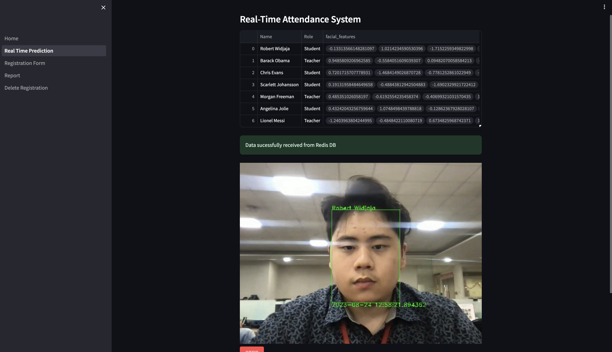

# Facial Attendance Platform

## This program is meant to reduce administrative workload by using precise fast face recognition.

Facial Attendance Platform is a Python-based web application that uses OpenCV, Redis, and Streamlit to streamline the process of tracking attendance using facial recognition.

This Facial Attendance Platform uses InsightFace API and Maching learning searching algorithms to accruately detect facial features that uniquely identifies a person.

## Features

- [x] Real-time facial recognition for attendance tracking.
- [x] User-friendly web interface built with Streamlit.
- [x] Store attendance records in Redis for quick retrieval and analysis.
- [x] Easily configurable and customizable.
- [x] Registration form using webcam to collect samples
- [x] Reporting modules that has real-time updates when a person is marked for attendance  

# DEMO

## Initally, your face features have not been registered.

## Register your face using the registration form to collect samples, takes only a few seconds!

## Go back to the face prediction to mark your attendance. Attendance is marked every 10s.

## Attendance will be recorded in the reporting module.

## In case an employee/student has left/graduated. You can remove their data simply by clicking on a few selections

